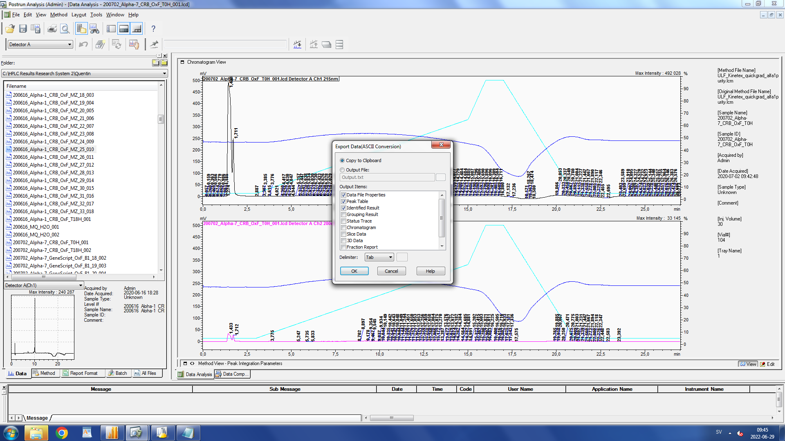

```{r setup, include=FALSE}
knitr::opts_chunk$set(echo = TRUE, tidy=TRUE, message = FALSE, warning = FALSE)
```

## Learning outcomes: arranging and annotating plots

If you're not familiar with liquid chromatography - mass spectrometry (LC-MS), these are two sets of techniques often used together. The first  (LC or HPLC) is a separation method based on unique/individual physicochemical properties of each compound and the second (MS or HRMS) is a method to measure ions often denoted as _m/z_ (mass over charge). Hence if you have a solution with a mixture of different and/or unknown compounds, the LC allows separation and the MS gives you a hint of what it could be. 

The software to run these instruments gives you an output, but typically, an instrument screenshot is not a nice figure and looks a bit unprofessional. But as long as you can get your hands on the raw data, making nice figures is totally feasible.

In this exercise, we'll first draw the chromatograms, then draw and annotate some mass spectra and finally generate compound figures. 

```{r, fig.cap="Stock image. The data did not in fact come off our Shimadzu system but another Waters HPLC-MS. However, after a bit of convincing, most vendor software will alow the export of raw ASCII data somehow."}

```

## Mass chromatograms

You typically get a number of columns but one said RT (which I assumed meant retention time, in minutes). It also looked about right, increasing from almost 0 to about as long as the HPLC run lasted. Then I played around trying to figure out which column was the right, given that I knew which chromatogram shape to expect. For convenience I've removed all unnecessary information so that you only have the retention time and signal left.

There are three files in the data directory. All three are selected ion chromatograms for a specific compound _m/z_. One is derived from a native sample, one is derived from a synthetic compound that we believe to be that same _m/z_ as in the native extract and the third is the native extract spiked with the synthetic compound. If the synthetic and the native compound are identical, they should elute at the same time. Let's check!

Load the data files starting with 210721_... and have a look. They're pretty stripped of any information. The first column (default: V1) is RT, the second (default: V2) is signal intensity. 

```{r}
synthetic <- read.csv("data/210718_synthetic_mz1080.txt", header=F, sep="\t")
native <- read.csv("data/210718_native_mz1080.txt", header=F, sep="\t")
spiked <- read.csv("data/210718_spiked_mz1080.txt", header=F, sep="\t")

library(tidyverse)
```

For waaaayyy at the end, we need a single clean plot of an individual chromatorgram, so let's produce that quickly and forget about it. It's still practice so it counts!
```{r}
# This will do, it's just for a demo

r <- ggplot(spiked, aes(x=V1, y=V2))+
  geom_line()+
  theme_bw()
r
```


In order to plot them we'll combine them to a single data frame (I'll call mine "ion_chromatograms"). Before doing so, we'll add information on which experiment they came from. _You've done this before, I don't think you need a hint._

```{r}
synthetic["exp"] <- c("synthetic")
native["exp"] <- c("native") 
spiked["exp"] <- c("spiked")

ion_chromatograms <- rbind(synthetic, native, spiked)
colnames(ion_chromatograms) <- c("rt", "signal", "experiment")
```

What do they look like? "Quick and dirty" plot to see what we're dealing with:

```{r}
ggplot(ion_chromatograms, aes(x=rt, y=signal, group=experiment))+
  geom_line(aes(col=experiment))
```

What we can take from this is that it seems the biggest peak is roughly at the same retention time. But the signals are of very different strength, so it's hard to see. To get them to a more similar magnitude, we'll divide the values for each chromatogram by the maximum value (This is easiest starting from the original data frames and then combining them again). This calculation scales everything to a number between 0 and 1. We also only need a short window of this whole run, say between 14 and 18 min. 

```{r}
synthetic["percent"] <- synthetic$V2/max(synthetic$V2)
native["percent"] <- native$V2/max(native$V2)
spiked["percent"] <- spiked$V2/max(spiked$V2)

ion_chromatograms <- rbind(synthetic, native, spiked)
colnames(ion_chromatograms) <- c("rt", "signal", "experiment", "percent")
```

Let's plot it again and clean up a bit on the way:

I also felt like adding horizontal lines at the maximum value of each chromatorgram which should be the peak of our compound of interest. My choice of colors is poor. I think you can do better.

```{r}
library(viridis)

#ion_chromatograms$rt[ion_chromatograms$experiment=="synthetic" & ion_chromatograms$percent==1] # took me a minute to figure out
# we want the value for retention time (to draw the vertical line at that point), where the experiment is "synthetic" and the percentage is 1 (which is the maximum).

#viridis(n) to get n hex values for discrete colours from the spectrum.
#viridis(3) "#440154FF"-dark blue "#21908CFF"-green "#FDE725FF"-yellow

p <- ggplot(ion_chromatograms, aes(x=rt, y=percent, group=experiment))+
  geom_line(aes(col=experiment))+
  xlim(14,18)+
  geom_vline(xintercept =ion_chromatograms$rt[ion_chromatograms$experiment=="synthetic" & ion_chromatograms$percent==1], linetype = 'dotted', col="#FDE725FF")+
  geom_vline(xintercept =ion_chromatograms$rt[ion_chromatograms$experiment=="spiked" & ion_chromatograms$percent==1], linetype = 'dotted', col="#21908CFF")+
  geom_vline(xintercept =ion_chromatograms$rt[ion_chromatograms$experiment=="native" & ion_chromatograms$percent==1], linetype = 'dotted', col="#440154FF")+
  theme_bw()+
  labs(x="Retention time [m]", y="relative signal intensity")+
  scale_color_viridis(discrete = TRUE, option = "D")+
  theme(legend.position = 'bottom')
p

```

Okay. Let's say we're happy with this provisional figure. This mass chromatogram comes with mass spectra that I'd like to (a) visualize and (b) display alongside. That's why I've saved it for later ("p") as you may have noticed.

## Mass spectra

The mass spectra files also start with '210718_' and end in '_spec.txt'. They also have just two columns of data, the first (default: V1) is the _m/z_ (colloquially the "mass") and the second (default: V2) the signal intensity.

```{r}
mass_synthetic <- read.csv("data/210718_synthetic_spec.txt", header=F, sep="\t")
mass_nativ <- read.csv("data/210718_nativ_spec.txt", header=F, sep="\t")
mass_spiked <- read.csv("data/210718_spiked_spec.txt", header=F, sep="\t")

head(mass_synthetic)
ggplot(mass_synthetic, aes(x=V1, y=V2))+geom_line()
```

I'd like you to highlight with boxes the mass ranges of three different compounds when they're present (that is, in the spiked data there is only the last mass present). The fact that you see these hand-shaped patters is due to that peptides can incorporate different carbon isotopes and thus the same compound exists but with a subtle mass difference.

 - Peptide A _m/z_ 1071, transparent blue box
 - Peptide B _m/z_ 1076, transparent red box
 - Peptide C _m/z_ 1080, transparent green box

This time, I'm asking you to do it for one data frame at a time, that is, keep them separated. You can remove the axis titles, too.
```{r}
m1 <- ggplot(mass_nativ, aes(x=V1, y=V2))+
  geom_line()+theme_classic()+
  theme(axis.text.x = element_text(angle = 90, vjust = 0.5, hjust=1))+
  scale_x_continuous(limits = c(1070,1084), breaks = seq(1070, 1084,1))+xlab("[m/z]")+ylab("Signal intensity")+
  annotate("rect", xmin = 1071.5, xmax = 1074, ymin = 0, ymax = 5e7, alpha = .1,fill = "blue")+
  annotate("rect", xmin = 1076.3, xmax = 1078.5, ymin = 0, ymax = 5e7, alpha = .1,fill = "red")+
  annotate("rect", xmin = 1080, xmax = 1082, ymin = 0, ymax = 5e7, alpha = .1,fill = "green")+
  labs(x=NULL, y=NULL, title=NULL)
m1

m2 <- ggplot(mass_synthetic, aes(x=V1, y=V2))+
  geom_line()+theme_classic()+
  theme(axis.text.x = element_text(angle = 90, vjust = 0.5, hjust=1))+
  scale_x_continuous(limits = c(1070,1084), breaks = seq(1070, 1084,1))+xlab("[m/z]")+ylab("Signal intensity")+
  annotate("rect", xmin = 1080, xmax = 1082, ymin = 0, ymax = 5e7, alpha = .1,fill = "green")+
  labs(x=NULL, y=NULL, title=NULL)
m2

m3<- ggplot(mass_spiked, aes(x=V1, y=V2))+
  geom_line()+theme_classic()+
  theme(axis.text.x = element_text(angle = 90, vjust = 0.5, hjust=1))+
  scale_x_continuous(limits = c(1070,1084), breaks = seq(1070, 1084,1))+xlab("[m/z]")+ylab("Signal intensity")+
  annotate("rect", xmin = 1071.5, xmax = 1074, ymin = 0, ymax = 6e7, alpha = .1,fill = "blue")+
  annotate("rect", xmin = 1076.3, xmax = 1078.5, ymin = 0, ymax = 6e7, alpha = .1,fill = "red")+
  annotate("rect", xmin = 1080, xmax = 1082, ymin = 0, ymax = 6e7, alpha = .1,fill = "green")+
  labs(x=NULL, y=NULL, title=NULL)
m3
```

## Combining plots

Now we'll use one of the underlying/basic plotting packages called [gridExtra](https://cran.r-project.org/web/packages/gridExtra/vignettes/arrangeGrob.html). This allows us to freely generate composite figures. The results looks kinda like facet_grid or facet_wrap might have produced something similar but this package allows for more flexibility and I'm not sure you can easily highlight different things in different plots with those functions. (Tbh, I haven't looked it up).

```{r}
library(gridExtra)
library(grid)

yleft <- textGrob("Signal intensity", rot = 90) # this will be the y-axis label
bottom <- textGrob("Retention time [m]") # this will be the x-axis label

grid.arrange(m1, m2, m3, bottom=bottom, left = yleft) # here we call the tree plots that we saved and then specify annotation, i.e. axis labels
```

And you can define the exact layout and proportions! We're bringing back the chromatogram and add the mass spectra to it.

To understand the layout, have a look at the link above. Basically, we're dividing the output in a 3 x 3 grid and the first object gets two thirds of the width and the full height, the remaining third is split up vertically evenly between the three remaining objects.

```{r}
my_layout <- rbind(c(1,1,2),
                   c(1,1,3),
                   c(1,1,4))
grid.arrange(p, m1, m2, m3, layout_matrix = my_layout)
```

Final madness! We bring back the early single chromatogram you might have already forgotten about (I called it 'r') and combine it with it's mass spectrum.

```{r}
r+annotation_custom(ggplotGrob(m3), xmin = 20, xmax = 45, ymin = 5e6, ymax = 1.4e7)
```

Yo dawg, I heard you like plots. So I put a plot in your plot!

