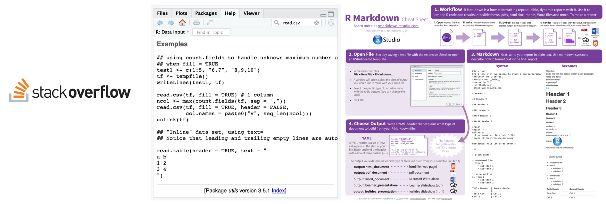
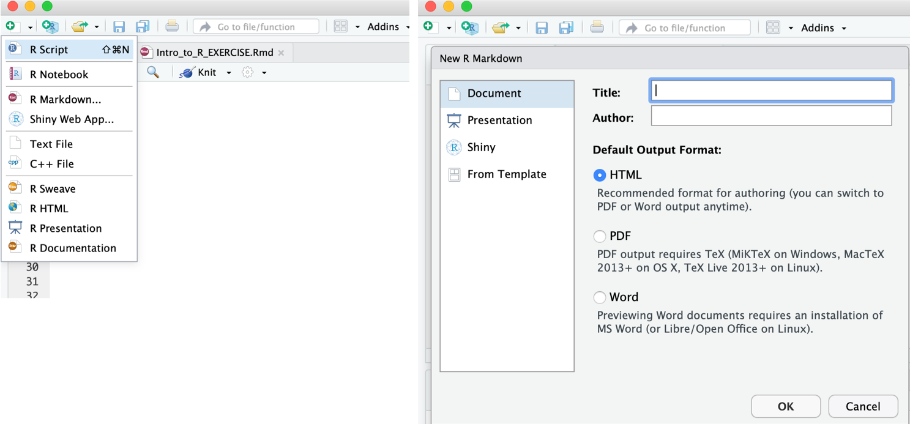

```{r setup, include=FALSE}
knitr::opts_chunk$set(echo = FALSE, tidy=TRUE, message = FALSE, warning = FALSE)
library(ggplot2)
library(tidyverse)
```

## Content

> * General intro to R and RStudio
> * Data handling
>    + importing and accessing data 
>    + manipulation and analysis 
>    + some "stats" 
> * Visualisation
>    + basics of generating plots
>    + making plots look pretty
> * Exercises
> * Open lab
> * Challenge

# About R and RStudio


- __R__: free software environment for statistical computing and graphics (and more)
- __RStudio__: GUI/ integrated development environment (IDE) for R  

## Advantages of using R

> * free
> * powerful, flexible/customisable, easy to develop complex analyses
> * reproducible science: scripts and markdowns  

## Data handling: collecting and organisation

__Conventions about data format__  

- Observations are entered in __rows__
- Variables are entered in  __columns__
- A column of data should contain only one data type  

## Data handling: collecting and organisation

__Best practice__  

> * Store a copy of data in nonproprietary formats
> * Leave an uncorrected file when doing analyses
> * Maintain effective metadata about the data
> * Create folders for relevant task to keep the overview over your analyses

## Error messages

- Warnings can be ignored.
- Specific hint? e.g. 
    - wrong data format, characters/factors instead of numbers
    - library not loaded, package not installed
- Try running example code, and check the example input
- Google is your friend  

## R help & the comunity

- Stackoverflow
- `man` pages and examples
- cheat sheets



## Scripts and markdowns

Markup languages (HTML, LaTeX, markdown) are used to format text. Both exercises and presentations during this lab have been produced using the rmarkdown package. The code for these are available in the files Intro_to_R.Rmd and Intro_to_R_EXERCISE.Rmd. For longer-form writing, including reports and papers, check out the bookdown package.  



# Getting started

> * open RStudio
> * open a script or markdown document
> * start typing/ working
> ...  

## How R works: Operators & Functions 

- Arithmetic (basic math): `+`, `-`, `*`, `/`, `^`, ...
- Relational: `<`, `>`, `==`, `!=`
- Logical: `!`, `&`,`&&`, `|`, `||`, `TRUE`, `FALSE` 
- Assignment: `<-`, `=`
- Pipe: `%>%`
- Specifying ranges (colon): `:`
- Access library functions: `::`
- Comment: `#`
- Functions: e.g. `c()`, `sum()`, `ggplot()`, ...
- Tilde operator (specify models, functions): `~`

## How R works: Operators 

Examples: Arithmetic (basic math): +, -, *, /, ^, ... 

```{r operators1, echo=TRUE}
12+13+14
(5+2)*2
12^2
```

## How R works: Operators & Functions

__Assignment (<-, =)__  

```{r operators2, echo=TRUE}
x <- 12
y <- 13
z <- 14
x
x+y+z
```
## How R works: Operators & Functions

function(data, additional arguments)  
```{r function1, echo=TRUE}
sum(12,13,14)
sum(x, y, z)
k <- c(12, 13, 14)
k
sum(k)
```

# How to access and modify parts of data structures

- How to access parts in **vectors** and tables 
- How to work with tables (**data frame**/**data table**/**tibble**/**matrix**)

## How to access and modify parts of data structures: vectors

vector[element_number], length(vector)

```{r access_vectors, echo=TRUE}
k
k[2]
length(k)
(k[4] <- 15)
length(k)
```

## How to access and modify parts of data structures: vectors

vector[element], length(vector)

```{r access_vectors2, echo=TRUE}
animals <- c("platypus", "nudibranch", "potoo", "peacock mantis shrimp")
animals[3:4]
```

## How to access and modify parts of data structures: tables

table[rows, columns], table$column_name, dim(table)

```{r access_tables, echo=TRUE, eval=T}
df <- tibble(k, animals, colour=c("brown", "rainbow", "brown", "rainbow"))
df
df$colour
```

## How to access and modify parts of data structures: tables

table$column, table[rows, columns], dim(table)

```{r access_tables2, echo=TRUE, eval=T}
dim(df)
df[1:2,]
df[df$colour=="brown",] #select rows that match a condition
```

## Functions to start with: Importing data and inspecting it

```{r functions3, echo=TRUE, eval=FALSE}
# Working directory: setwd(), getwd()
setwd("~/Path/to/working_directory")
getwd()

# tidyverse, this requires loading the library
library(tidyverse)
data <- read_delim("file.csv")
data <- read_tsv("file.tsv")
data <- read_csv("file.csv")
# base R: read.csv()
data <- read.csv("~/Path/to/file.csv", header=TRUE, sep = ",")

# inspect the data structure
head(data)
tail(data)
dim(data)
str(data)
rownames(data)
colnames(data)
view(data)
```

# Working with tables (data frame, tibble, data table)

```{r tables, echo=TRUE}
#library(tidyverse)
mpg # data set included in ggplot2 package
```

## Working with tables

```{r filter_select, echo=TRUE, eval=T}
mpg %>% 
  filter(manufacturer=="lincoln")

mpg %>%
  select(-c(displ,year,cyl,trans,drv,fl,class))
```
## Working with tables

```{r mutate, echo=TRUE, eval=TRUE}
mpg %>% 
  dplyr::rename(fuel=fl) %>%
  head(n=2)

mpg %>%
  mutate(city_kmL=cty/2.352) %>%
  select(c(manufacturer, model, displ, year, city_kmL))
```

## Working with tables

```{r summarise, echo=T, eval=T}
# median(), sd(), IQR(), min(), max(), n()
summary <- mpg %>%
  summarise(mean_fuel = mean(cty))
summary
```

## Working with tables

```{r pivot, echo=T, eval=T}
mpg %>%
  pivot_longer(c(cty, hwy), names_to="city_highway", values_to="mpg") %>%
  select(manufacturer, model, year, trans, city_highway, mpg)
```

## Working with tables

```{r piv_sum, echo=T, eval=T}
mpg %>%
  pivot_longer(c(cty, hwy), names_to="city_highway", values_to="mpg") %>%
  summarise(mean_fuel = mean(mpg))
```

## Working with tables

```{r join, eval=TRUE, echo=TRUE}
car_origins <- tibble(
  manufacturer=c("audi", "chevrolet", "dodge", "ford", "honda", "hyundai", "jeep", "land rover", "lincoln", "mercury", "nissan", "pontiac", "subaru", "toyota", "volkswagen"),
  country_origin=c("Germany", "USA", "USA", "USA", "Japan", "South Korea", "USA", "USA", "USA", "USA", "Japan", "USA","Japan", "Japan", "Germany"))
head(car_origins, n=3)

mpg %>%
  left_join(car_origins) %>%
  select(c(manufacturer, model, year, trans, country_origin))
```

## Working with tables

```{r diff_tidy_base, echo=T, eval=TRUE}
mpg %>%
  summarise(mean_fuel = mean(cty))

mean(mpg$cty)
```

# Data visalisation with ggplot2  

ggplot(table, aes(x=column1, y=column2))+geom_...()

```{r plot1, echo=TRUE, eval=TRUE}
ggplot(mpg, aes(x=manufacturer, y=cty))+geom_point()
```

## Data visualisation with ggplot2  

*What kind of "geom" to use?*

Check out the [R graph gallery](https://r-graph-gallery.com/)!

*How about colours?*

Try out different colour palettes inspired from [Wes Anderson movies](https://github.com/karthik/wesanderson) or [Studio Ghibli](https://github.com/ewenme/ghibli).
Or find good colour combinations [here](https://medialab.github.io/iwanthue/) and specify them manually.

*Easy professional styles?*

Explore different styles from the ggthemes package last_plot()+theme_

*Feel silly?*

https://cran.r-project.org/web/packages/xkcd/vignettes/xkcd-intro.pdf

# Exercise material

Open the html file in your browser read and code along. Every chapter is a small story and you'll see how to use R and different visualization to guide your data analyses. 

There are 'Hints', 'Answers' and 'Solutions'. But the content is hidden so that you first think and try yourself. Then you can click on the 'Code' button to reveal the content.

 - **Bioassay**: data manipulation, plotting, using specific packages: dose-response curve calculation
 - **Targeted metabolomics**: Multiple plots, reordering factors, correlation analysis, t-test, while loop
 - **LCMS**: arranging and annotating plots
 - **Multivariate data analysis**: PCA, interactive 3D plots
