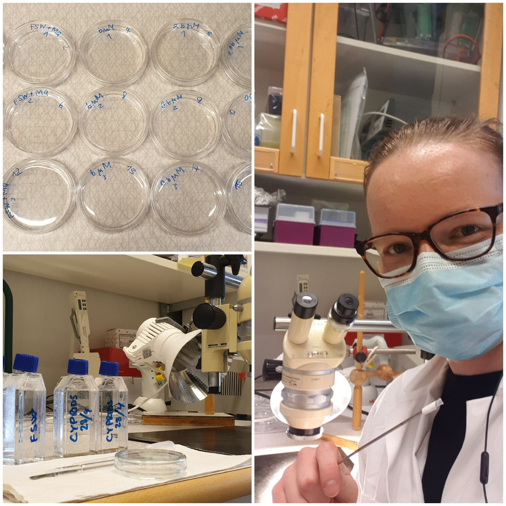
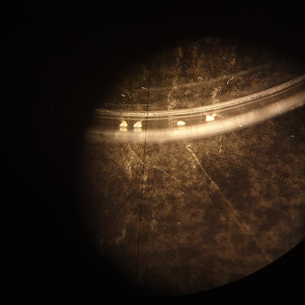

```{r setup, include=FALSE}
knitr::opts_chunk$set(echo = TRUE, tidy=TRUE, message = FALSE, warning = FALSE)
```

## Learning outcomes: data manipulation, plotting, using specific packages: dose-response curve calculation

The data in this exercise comes from an antibiofouling assay with barnacle larvae. Biofouling is the process of microorganisms, plants, algae, or small animals attaching to surfaces in water or liquid media. We wanted to assay the antibiofouling effect of a newly isolated compound. To do so, we've added the compound in different concentrations to a petri dish with sea water and added about 20 (±2) barnacle larvae. We made five replicates per treatment. The "settlement" is the number of larvae that attached (settled) to each petri dish surface. If the new compound inhibits biofouling (which would be the desired effect), we should see a decrease in number of larvae settled.

```{r, echo=FALSE, fig.show = "hold", out.width = "50%", fig.align = "default", fig.cap="Left: The petri dishes with the bioassays and me and my larvae picker. Right: View of a petri dish through a binocular. The white mountains are barnacles that settled at the edge of the dish."}



```

## Basic data manipulation and plotting

Let's first load the data (settlement_assay_data.csv) and take a look:

Hint:
```{r, echo=TRUE, eval=FALSE}
# Use whichever you deem appropriate, they might need further arguments

# base R: read.csv()
data <- read.csv("~/Path/to/file.csv")

# tidyverse
data <- read_delim("file.csv") # or 
read_csv() # or
read_tsv()

# you might need to load the corresponding libraries e.g. library("tidyverse")
```

Solution:
```{r, echo=TRUE, eval=TRUE}
# set working directory, useful if you work in a simple R script.
#setwd("~/Documents/Courses/ULLA_2022/exercise_material_collection/") 

# I like to save all my raw data as csv and use base R. I'm also usually supremely uncreative and all my data sets are called "data", "df" (data frame) or "ds" (data set). However, meaningfully naming your data helps you when you get back to script later to use it again.

# load data
df <- read.csv("data/settlement_assay_data.csv", header = T, sep = ",") 
df 
```

Depending on which command you used, your result might look slightly different. Does it generally look correct? What do you notice about the column names (check the original csv file)?
Verify that the content is right (numeric vs integer).

Hint:
```{r, echo=TRUE, eval=FALSE}
# inspect the data structure, some of these might come in handy
head()
tail()
dim()
str()
colnames()
rownames()
(df) # type the name of your data frame with or without parentheses
```

Solution:
```{r, echo=TRUE, eval=TRUE}
str(df)
```

The plotting function in ggplot2 expects data for x and y axes in columns. Therefore, we need to format the data frame to the "long format" where one column is the treatment and the other is the corresponding value (settlement count).

Hint:
```{r, echo=TRUE, eval=TRUE}
# look up the function pivot_longer()

# As you can see below, I've called the new columns "treatment" and "settlement_count"
```

Solution:
```{r, echo=TRUE, eval=TRUE}
library(tidyverse)
#colnames(df) # this command tells you all the column names of your data frame. I used it to copy paste them into the next command.

bioassay <- pivot_longer(df, c(control, X0.06.µM, X0.6.µM, X6.µM), names_to="treatment", values_to="settlement_count") # alternatively: cols = everything()
head(bioassay)
```

Now we can start exploring the data visually. Below you'll see a number of plots. I've added one command at a time as if I was typing and developing this myself. You don't need to produce all these plots, they're just meant to illustrate the process of figuring out what you can and want to do.

Start by initializing the plot. We aim to produce a plot illustrating the variance in numbers of settlement (along the y axis) in the different treatment groups (on the x axis).

Hint:
```{r}
# we'll use the package ggplot2 which you can load on its own. However, I think you've already loaded tidyverse where it is also included. So no need to worry.

# General syntax see below. You need to replace the data frame and column names with the corresponding names of your data

# ggplot(data_frame, aes(x=column_x, y=column_y))
```

Solution:
```{r, echo=TRUE, eval=TRUE}
library(ggplot2)

# basic data
ggplot(bioassay, aes(x=treatment, y=settlement_count))
```

Adding "geometries", i.e. how you'd like to represent the data. We'll go with the boxplots in the style of Tukey.

Hint:
```{r}
# add geom_...
```

Solution:
```{r, echo=TRUE, eval=TRUE}
ggplot(bioassay, aes(x=treatment, y=settlement_count))+
  geom_boxplot()
```

Sometimes it can be useful to add the data points so that it's clear how many data points this plot is based on. Let's try that.

Hint:
```{r}
# add geom_...
```

Solution:
```{r, echo=TRUE, eval=TRUE}
ggplot(bioassay, aes(x=treatment, y=settlement_count))+
  geom_boxplot()+
  geom_point()
```

Does this look right? How many data points do you expect?

Answer:
```{r}
# We know we have five replicates per treatment, so we should see five points. What's happening here is called overplotting. Some of the points overlap. How can we remedy that?

# There are a number of possible solutions that come to my mind:

# - you could change transparency with a factor called 'alpha', but that might be confusing as it looks like you use two different colours.

# - you could label the data points using the 'ggrepel' library, but this is not a very common thing to do in such plots.

# - you could chose a density plot like geom_violin() but that seems a bit excessive for five data points

# - instead, I suggest you add the data points with 'jitter' (geom_jitter()) instead of geom_point(), which will randomly spread out the data points a bit.
```

Solution:
```{r, echo=TRUE, eval=TRUE}
ggplot(bioassay, aes(x=treatment, y=settlement_count))+
  geom_boxplot()+
  geom_jitter()
```

This adds a bit of random variation to each data point both in the x and y dimension. However, given that we care about the y axis, this seems a bit wrong I think. Can you figure out how to only spread out the points horizontally?

Hint:
```{r}
# Look up how you can modify geom_jitter().
```

Solution:
```{r, echo=TRUE, eval=TRUE}
ggplot(bioassay, aes(x=treatment, y=settlement_count))+
  geom_boxplot()+
  geom_jitter(height = 0)
```

Okay but now that we look at this figure, do we see the right number of points? Still no... Why is that?

Answer:
```{r}
# The geom_boxplot() depicts outliers as dots, so those are now visible twice.
```

Can you figure out how to not display the additional data points?

Solution:
```{r, echo=TRUE, eval=TRUE}
ggplot(bioassay, aes(x=treatment, y=settlement_count))+
  geom_boxplot(outlier.shape = NA)+
  geom_jitter(height = 0)
```

However, come to think of it, wouldn't a barplot with error bars be a better representation of the data? Let's give it a try!

In the box plots, you didn't really need to specify the underlying math to calculate the size of the box and the whiskers, that's done automatically given the very specific type of this plot. However, for bar plots you'll need to specify what you want. Generally, there are two ways of doing that. Either you specify it in the parentheses of the geom_...(), or you do the desired calculations (e.g. mean and standard deviation by group) yourself and plot that new data table. If you want to add the error bars, the second option is more straight forward, but I'll show you both.

Just FYI, I usually forget about this, get an error message, remember that I had to google something and then find the solution online or in my old code. That is totally fine! :)

Hint 1:
```{r}
# pass the following arguments to the new geom 
# stat = "summary"
# fun = "mean"
```

Solution 1:
```{r}
ggplot(bioassay, aes(x=treatment, y=settlement_count))+
  geom_bar(stat = "summary", fun = "mean") # version 1 with the full data set ("bioassay"), but as far as I know, now it'd be complicated to add the error bars. So let's try the other way.
```

Hint 2:
```{r}
# For doing the math yourself you can have a look at the aggregate() function in the stats package. You'll need to specify which data_frame$column you want to aggregate over, by which data_frame$column you want to aggregate and which function (mean or sd) you want to apply.

# Or you can work with pipes (%>%) group_by() and summarize() from the dplyr and tidyverse libraries. 

# For this approach, you'll need to pass the following argument ' stat = "identity" ' to the geom_ as you just want it to take the numbers as they are.
```

Solution 2:
```{r, echo=TRUE, eval=F}
# base R function to calculate mean and sd (standard deviation)...
aggregate(bioassay$settlement_count, by=list(bioassay$treatment), mean)
aggregate(bioassay$settlement_count, by=list(bioassay$treatment), sd)
# ... you can save the new output to an object with the ' <- ' and combine to one new table
```

```{r, echo=TRUE, eval=TRUE}
# saving group mean table
summary <- aggregate(bioassay$settlement_count, by=list(bioassay$treatment), mean) 
# have a look at the table, for now the columns are just called "Group.1" and "x", so we'll rename them "treatment" and "mean"
colnames(summary) <- c("treatment", "mean")
# saving group standard deviation table
summary_sd <-aggregate(bioassay$settlement_count, by=list(bioassay$treatment), sd) 
# adding the column with the standard deviation to the first table.
summary["sd"] <- summary_sd$x 
rm(summary_sd) # delete the superfluous table
summary

# OR work with pipes

#library(dplyr)
bioassay %>% 
  group_by(treatment) %>% 
  summarize(mean = mean(settlement_count),
            sd = sd(settlement_count))

## You can either use the first version and generate a new plot or directly pipe (%>%) the modified data into the plotting command:

ggplot(summary, aes(x=treatment, y=mean))+
  geom_bar(stat = "identity")+
  geom_errorbar(aes(ymin=mean-sd, ymax=mean+sd), width = 1) # up to you to adjust the size of the error bars ;-)

bioassay %>% 
  group_by(treatment) %>% 
  summarize(mean = mean(settlement_count),
            sd = sd(settlement_count))%>% 
  ggplot(aes(x=treatment, y=mean))+
  geom_bar(stat = "identity")+
  geom_errorbar(aes(ymin=mean-sd, ymax=mean+sd), width = 1)
```

As you see, both ways produce equivalent results both for summarising and for plotting.


Now you've got the plots itself figured out. But I said I'd teach you how to make pretty plots and this isn't super pretty yet. So let's try out some polishing. I'll suggest you modifications to challenge you but you're welcome to explore by yourself!

Before you continue one more handy trick. You can save the plot as you saved other objects, that allows you to not copy all code all the time as you add to it. Like so:

```
p <- bioassay %>% 
  group_by(treatment) %>% 
  summarize(mean = mean(settlement_count),
            sd = sd(settlement_count))%>% 
  ggplot(aes(x=treatment, y=mean))+
  geom_bar(stat = "identity")+
  geom_errorbar(aes(ymin=mean-sd, ymax=mean+sd), width = 0.2)
```

Now you can call the plot any time by typing 'p' and in the similar additive fashion, you can continue adding changes (and continue saving if you like), e.g.

```
p  <- p+ggtitle("Bioassay")
p
```

However, as we see in a bit, some modifications require you to make changes to this original code so you might want to keep it around.

## Polishing

Text: Axis names and labels, and a title. How about you change the x-axis tick marks to just numbers and specify for the x axis title "Dose in µM" and for the y axis "Mean settlement per assay". The title could be "Biofouling assay with _Amphibalanus improvisus_".

Hint:
```{r}
# check the ggplot2 cheat sheet for commands for axis labels! 

# For renaming axes I think the easiest is actually to add a new column and use that instead of your x-axis.
```

Solution for tick marks:
```{r}
bioassay %>% 
  group_by(treatment) %>% 
  summarize(mean = mean(settlement_count),
            sd = sd(settlement_count))%>% 
  add_column(concentration = c(0, 0.06, 0.6, 6))%>%  #this is new, adding concentrations
  ggplot(aes(x=as.factor(concentration), y=mean))+ # here I changed 'treatment' for the new 'concentration' and I said it should be a factor instead of a numerical value. You can remove the 'as.factor()' and see the difference!
  geom_bar(stat = "identity")+
  geom_errorbar(aes(ymin=mean-sd, ymax=mean+sd), width = 0.2)
```

alternative solution in base R: (you can skip this if you're happy)
```{r}
# add a new column to the existing data frame
summary["concentration"] <-  c(0, 0.06, 0.6, 6)
# followed by the ggplot command as above
```

Working on axis titles:
```{r}
bioassay %>% 
  group_by(treatment) %>% 
  summarize(mean = mean(settlement_count),
            sd = sd(settlement_count))%>% 
  add_column(concentration = c(0, 0.06, 0.6, 6))%>%  
  ggplot(aes(x=as.factor(concentration), y=mean))+ 
  geom_bar(stat = "identity")+
  geom_errorbar(aes(ymin=mean-sd, ymax=mean+sd), width = 0.2)+
  labs(x="concentration in µM", y="Mean settlement per assay", title = "Biofouling assay with Amphibalanus improvisus")
```

Almost! How can we make the barnacle species name italic?

Hint:
```{r}
# Look it up on the internet :p

# The solution that worked for me is defining my_new_title using the 'expression' command and the word italic. Then instead of the actual title, in the ggplot command, I specify my_new_title as title.
```

Solution:
```{r}
my_title <- expression("Biofouling assay with"~ italic("Amphibalanus improvisus"))

bioassay %>% 
  group_by(treatment) %>% 
  summarize(mean = mean(settlement_count),
            sd = sd(settlement_count))%>% 
  add_column(concentration = c(0, 0.06, 0.6, 6))%>%  
  ggplot(aes(x=as.factor(concentration), y=mean))+ 
  geom_bar(stat = "identity")+
  geom_errorbar(aes(ymin=mean-sd, ymax=mean+sd), width = 0.2)+
  labs(x="concentration in µM", y="Mean settlement per assay", title = my_title)

```

Let's change the grey background for a cleaner one. Pick any you like from the list of themes from ggplot or ggthemes (they both start with 'theme_')!

```{r}
library(ggthemes)
bioassay %>% 
  group_by(treatment) %>% 
  summarize(mean = mean(settlement_count),
            sd = sd(settlement_count))%>% 
  add_column(concentration = c(0, 0.06, 0.6, 6))%>%  
  ggplot(aes(x=as.factor(concentration), y=mean))+ 
  geom_bar(stat = "identity")+
  geom_errorbar(aes(ymin=mean-sd, ymax=mean+sd), width = 0.2)+
  labs(x="concentration in µM", y="Mean settlement per assay", title =my_title)+
  theme_clean() # this was my random choice, you can pick whatever you like. Try all of them to see what's out there.
```

How about adding some colour?! I think every treatment should get it's own :D
There are many ways to specify colour, you can let ggplot decide, pick from preexisting colour palettes or specify hex colours yourself. This one is my favourite: #002FA7.

Hints:
```{r}
# Colour can be a little tricks sometimes as you might intuitively think of 'color'= ... but have a look at 'fill=...' as well. E.g. here, you want to fill in the bars of the barplot. Tbh, I usually just try and see which one works.

# You need to specify colour/fill in the geom_ you want to colour. For manually specifing particular colours, also look up and add e.g. scale_color/fill_manual()

# Colour/fill is an 'aes-'thetic.
```

Three ways for specifying colours:

```{r}
bioassay %>% 
  group_by(treatment) %>% 
  summarize(mean = mean(settlement_count),
            sd = sd(settlement_count))%>% 
  add_column(concentration = c(0, 0.06, 0.6, 6))%>%  
  ggplot(aes(x=as.factor(concentration), y=mean))+ 
  geom_bar(stat = "identity", aes(fill=treatment))+ # I added ', aes(fill=treatment)' and let ggplot decide
  geom_errorbar(aes(ymin=mean-sd, ymax=mean+sd), width = 0.2)+
  labs(x="concentration in µM", y="Mean settlement per assay", title =my_title)+
  theme_clean()

bioassay %>% 
  group_by(treatment) %>% 
  summarize(mean = mean(settlement_count),
            sd = sd(settlement_count))%>% 
  add_column(concentration = c(0, 0.06, 0.6, 6))%>%  
  ggplot(aes(x=as.factor(concentration), y=mean))+ 
  geom_bar(stat = "identity", aes(fill=treatment))+
  scale_fill_manual(values = c("#002FA7", "#1DACD6", "#0047ab", "#40e0d0"))+
  geom_errorbar(aes(ymin=mean-sd, ymax=mean+sd), width = 0.2)+
  labs(x="concentration in µM", y="Mean settlement per assay", title =my_title)+
  theme_clean()

library(wesanderson)
bioassay %>% 
  group_by(treatment) %>% 
  summarize(mean = mean(settlement_count),
            sd = sd(settlement_count))%>% 
  add_column(concentration = c(0, 0.06, 0.6, 6))%>%  
  ggplot(aes(x=as.factor(concentration), y=mean))+ 
  geom_bar(stat = "identity", aes(fill=treatment))+
  scale_fill_manual(values = wes_palette("GrandBudapest1"))+  # this is a colour palette from the 
  geom_errorbar(aes(ymin=mean-sd, ymax=mean+sd), width = 0.2)+
  labs(x="concentration in µM", y="Mean settlement per assay", title =my_title)+
  theme_clean()
```

## Statistics

Before we continue a small disclaimer: I am no statistician. There might be errors in my choice of statistic test or interpretation. That said, I want to show you how to perform some of the basic tests, so let's give it a try! 

We have discrete data, more specifically proportions (how many out of the 20 ±2 larvae settled). The appropriate test is thus generally Fisher's exact test or a Chi-square test. We'll give both a go. To get started, check out the help documentation for 'chisq.test' and 'fisher.test'. Try the example code at the bottom. What does the input data look like? What are we missing?

Answer:
```{r}
# We need the total numbers of larvae or alternatively the number of larvae that didn't settle. (And it needs to be summarized to a across the replicates. That's for in a minute.)

# Luckily we've got that written down, too. All plates had 20 larvae except the control plate #5 where 17 larvae settled, and the 0.06 µM treatment plate #4 where 16 larvae settled. Can you add another column called "total" to the bioassay data frame where you put in these numbers?

# How would you figure out in which spots you need to put '21' instead of '20'?

# How can you create a new column with the number of the "free" larvae from the columns/numbers of total and settled larvae?
```

Solutions:
```{r}
# As a reminder, what does our data frame look like?
#head(bioassay)

# adding a new column 'total' with the number 20
bioassay["total"] <- 20

# How can we find the cells that should be 21 instead of 20? 
```

```{r}
# We can have a look and find the row & column by clicking on the data frame name in the top right window panel ...

# ...or we can use 'which'!

# you see that there are two parts in the parentheses, linked by '&' (the logical 'and'). You can play around and see how it works by removing either part and checking the result. The way the conditions are stated translates to e.g. "which rows in the column 'treatment' in the data frame 'bioassays' are equal (contain) the character 'control' "
which(bioassay$treatment=="control" & bioassay$settlement_count==17)
which(bioassay$treatment=="X0.06.µM" & bioassay$settlement_count==16)

# Now that we found the rows, we can just replace the existing values (20) with the correct ones (21).
bioassay$total[17] <- 21
bioassay$total[14] <- 21

# Now, how can you create a new column with the number of the "free" larvae from the columns/numbers of total and settled larvae? It's just subtracting one from the other, right?
```

```{r}
bioassay["free"] <- bioassay$total-bioassay$settlement_count
head(bioassay)
```

Alright! Now that we've got all the numbers in place, remember how we summarized/aggregated the data frame previously? You can scroll up and find the code or maybe you still remember it. Either way, we need to produce a table as shown below, please! :D

Solution:
```{r}
# we'll aggregate/summarize across columns 2 and 4 ("settlement_count" and "free")

# I'll gove you two ways of doing it again, whichever works better for you is fine.

aggregate(bioassay[,c(2,4)], by=list(bioassay$treatment), sum)

bioassay %>% 
  group_by(treatment) %>% 
  summarize(settlement_count = sum(settlement_count),
            free = sum(free))
```

Many times, the default tests expect strictly numeric tables/matrices, so let's save the table, set the treatment column as row names and then delete it. That way, we're left with a table with only numbers but won't lose the information contained in the column.

```{r}
# save new table for easier manipulation
test_data <- aggregate(bioassay[,c(2,4)], by=list(bioassay$treatment), sum)
# as you can see from the first example code in the chisq.test documentation (## From Agresti(2007) p.39), the table only contains numbers. So we'll set the treatment categories (Group.1) as row names...
rownames(test_data) <- test_data$Group.1
# ... and delete the column.
test_data$Group.1 <- NULL
# now this looks like in the example code.
test_data
```

Let's put that to the test. Finally! Chi square test compares two (treatment) groups, so we'll have to specify manually which ones to compare from our table. 

__Chi-square test:__

```{r}
# compare control to 0.06 µM treatment
chisq.test(test_data[rownames(test_data)=="control" | rownames(test_data)=="X0.06.µM",])
#same as
chisq.test(test_data[1:2,])
```

_p_=0.8751, i.e. no reason to reject the H~0~ (Null hypothesis) that there is no difference between the groups.
How about control versus 0.6 µM?

```{r}
chisq.test(test_data[rownames(test_data)=="control" | rownames(test_data)=="X0.6.µM",])
chisq.test(test_data[c(1,3),])
# So now you've get the idea =)
```

_p_-value = 8.166e-06, that's significant! There is a significant difference between the groups.

__Fisher's exact test:__

```{r}
# If you have a look at e.g.the last example in the fisher.test (## 6th example in Mehta & Patel's JASA paper) in this test you can directly enter the full data frame.

fisher.test(test_data)

# However, in this case you don't know between which groups the significant difference occurs.
```

## IC~50~ and dose reponse curves

So far, we've relied on very general functions and I'm sure you're starting to appreciate how useful and generalizable R is. However, wonderful people have also made an effort at combining these general functions into more complex ready made packages and workflows. Up next, we'll have a look at one of those, the [drc package](https://journals.plos.org/plosone/article?id=10.1371/journal.pone.0146021) for dose response curve calculation. 

Personally, I find the best way to learn a new analysis workflow is to search for 'workflow I want to learn' + 'R' + 'tutorial' online. That's how I cam across [this gem](https://rstudio-pubs-static.s3.amazonaws.com/378543_5b5bda32bf0541a485ccc49efbea680a.html) illustrating how to use the drc package. I'm borrowing freely from it in the subsequent code and text. However, I find such specific workflow packages require a deeper understanding of a topic and more time to learn. Therefore, I'll try to give this section the character of a demonstration rather than expecting you to come up with it yourself. If you'd like to learn more, have a look at the  tutorial linked above when you have time.

IC~50~ is the “half-maximal inhibitory concentration” for an entity (typically a drug) against a biological process or function (eg, enzyme activity, cell number, metabolic activity). If you have an inhibitor of a given enzyme and an in vitro assay for that enzyme, the IC~50~ is the concentration of inhibitor at which that enzyme runs at 50% of its normal activity in that assay. IC~50~ is measured in mol/L.

First we fit an appropriate curve to our data:
```{r}
library(drc)

summary # check out the data frame

# 'mean' is the mean/average settlement per treatment, 'concentration' the concentration of our assayed compound

curved_fit <- drm(
  formula = mean ~ concentration, 
  data = summary,
  fct = LL.4(names = c("hill", "min_value", "max_value", "ec_50"))
  )

summary(curved_fit)
plot(curved_fit)
```

Then we plug in the parameters from fitting the curve into the IC~50~ formula:
```{r}
coefs <- setNames(curved_fit$coefficients, c("hill", "min_value", "max_value", "ec_50"))

# IC50 formula
ic_50 <- with(as.list(coefs),
  exp(log(ec_50) + (1 / hill) * log(max_value / (max_value - 2 * min_value)))
)
ic_50 
```
Our IC~50~ value is 0.63 µM. 

Let's draw a nice graph with those numbers. There's a couple of new things in this plot command: Have a look at stat_smooth, geom_vline, and did you notice the \\n in the title? 
```{r}
ggplot(summary, aes(x=concentration, y=mean))+geom_point()+
  stat_smooth(
    method = "drm", 
    method.args = list(fct = LL.4(names = c("hill", "min_value", "max_value", "ec_50"))), 
    se = FALSE) +
  ylim(0, NA)+
  theme_bw()+
  geom_vline(xintercept=ic_50, linetype=2)+
  labs(y="Larval settlement count", x="Concentration in µM", title="Biofouling inhibition assay dose response curve \nwith IC50 value as dashed line")
```

Well done! This is quite advanced but the beauty of using R is the community. Many times, people have already made an effort with specific analyses and made them available to share and use. 

## Groups (one final set of plots in this exercise)

For now, you've only ever had one set of data to plot. How about we spice it up and throw in some more. In our example, that could mean that we have performed the assay with more than one new compound and we'd like to visulaise that. How would we go about that?

Let's first make up some data for practice purpose:
```{r}
head(bioassay)

# I'm bad at making things up but bare with me, please. First, I'm copying the current data set.
bioassay2 <- bioassay
# Now I'm adding some of the free larvae to the settled. So clearly, my imaginary compound isn't as effective as the real deal. I'm rounding the numbers because there's only whole larvae and not 0.5 or so.
bioassay2$settlement_count <- round(bioassay2$settlement_count+0.6*bioassay2$free, digits = 0)
# Now I'm making sure that the rest of the numbers match up
bioassay2$free <- bioassay2$total- bioassay2$settlement_count
head(bioassay2)
```

Now we have two similar data frames for two hypothetical experiments. In order to plot them, we'll append one to the other. But before that, let's add a column called 'drug' to each of the data frames so that we can tell them apart later. The column should contain "new_compound" for the original data frame and "marketed_compound" for the one we just made up. You can do it!

Hint:
```{r, echo=TRUE, eval=FALSE}
df["new_column"] <- "whatever"

# For appending one at the end of the other, there's a function called 'rbind' in base R and 'bind_rows' in dplyr/tidyverse

```

Solution:
```{r}
bioassay["drug"] <- "new_compound"
bioassay2["drug"] <- "marketed_compound"
# head(bioassay) if you want to check that it looks alright

# these both produce the same result
full_experiment <- rbind(bioassay, bioassay2)
full_experiment <- bind_rows(bioassay, bioassay2)
```

Let's start with our plot, you know the drill. Therefore, I'm challenging you to these modifications:

 - summarise and add error bars (as you've done before)
 - use geom_point but make the dots be squares (so it looks professional ;-)
 - fill the squares by drug, i.e. experiment
 - connect them by a line
 - if you want to, you could add e.g. an asterisk or line to highlight significant difference as you just calculated them
 
```{r}
full_experiment %>% 
  group_by(drug, treatment) %>% 
  summarize(mean = mean(settlement_count),
            sd = sd(settlement_count))%>% 
  add_column(concentration = c(0, 0.06, 0.6, 6, 0, 0.06, 0.6, 6))%>% 
  ggplot(aes(x=as.factor(concentration), y=mean, group=drug))+
  geom_errorbar(aes(ymin=mean-sd, ymax=mean+sd), width = 0.1)+
  geom_line()+
  geom_point(stat = "identity", shape=22, size = 5, aes(fill=drug))+
  theme_light()+
  theme(legend.position="bottom")+
  labs(x="Concentration in µM", y="Average number of settled larvae")
```

Or how about

 - drawing a linear regression line
 - scaling the x-axis by log10
 - displaying the equation in the plot

We haven't done any of this yet, so Google is your friend :p

```{r}
#  For displaying e.g. an equation of the regression, the common way is to calculate it "outside" the plotting function and annotate the plot with it. 

lm_marketed_compound <- full_experiment %>% 
  filter(drug=="marketed_compound")%>%
  group_by(treatment) %>% 
  summarize(mean = mean(settlement_count))%>% 
  add_column(concentration = c(0, 0.06, 0.6, 6))%>%
  lm(concentration~mean, .) # lm for linear model

#lm_marketed_compound # Have a look at the object, there's way more information than what is printed to the console.

# for an equation such as y=mx+c, r^2=z
m1 <- round(coef(lm_marketed_compound)[1], digits = 2)
c1 <- round(coef(lm_marketed_compound)[2], digits = 2)
z1 <- round(summary(lm_marketed_compound)$r.squared, digits = 3)

full_experiment %>% 
  group_by(drug, treatment) %>% 
  summarize(mean = mean(settlement_count),
            sd = sd(settlement_count))%>% 
  add_column(concentration = c(0, 0.06, 0.6, 6, 0, 0.06, 0.6, 6))%>% 
  ggplot(aes(x=concentration, y=mean, group=drug))+
  geom_errorbar(aes(ymin=mean-sd, ymax=mean+sd), width = 0.1)+
  stat_smooth(method = lm, se=F)+  # here we specify the regression (linear model)
  geom_point(stat = "identity", shape=22, size = 5, aes(fill=drug))+
  scale_x_log10()+
  theme_light()+
  theme(legend.position="bottom")+
  labs(x="Concentration in µM", y="Average number of settled larvae")+
  geom_text(x=-0.5, y=5, label=paste("y=", m1,"x+",c1,", R^2=",z1))

```

This is the end of this exercise! I hope you found it useful. Let me know if you have questions, spotted errors or want to share improvements! We're all here to learn.